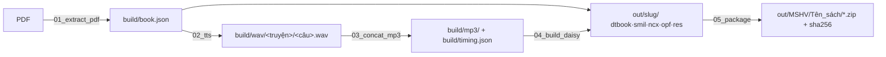

# Kế hoạch: sách nói DAISY 3 — *Những tấm lòng cao cả*

Đồ án môn Xử lý tiếng nói (K35). Hướng dẫn gốc: `../[VR] DAISY Guidelines.pdf`. Bộ mẫu của nhóm K34: `../mau/`.

## Bài toán

PDF có text sẵn (280 trang, ~101.700 từ, 99 bookmark) → sách DAISY 3 đầy đủ text + audio, đồng bộ cấp câu, mục lục 2 cấp (tháng → truyện). Đây là trường hợp 1 trong slide 11 (*có text, chưa có audio* → TTS thuần), không cần OCR hay STT.

## Pipeline

Mỗi bước là một script trong `scripts/` (gộp DTBook và SMIL/NCX/OPF vào một bước 04 vì cùng duyệt một cấu trúc; thứ tự đọc dùng chung nằm ở `book_units.py`), đọc từ bước trước, ghi ra `build/` (trung gian, xoá được) hoặc `out/` (nộp). Chạy lại một bước không cần chạy lại các bước trước.

## Quyết định và lý do

| Quyết định | Chọn | Vì sao | Đã loại | Xem lại khi |
|---|---|---|---|---|
| Đơn vị đồng bộ | **câu** | slide 6 yêu cầu cấp câu/cụm; TTS từng câu rồi **đo độ dài file** → `clipBegin/End` chính xác tuyệt đối, không cần forced alignment | từ (thừa), đoạn (không đạt yêu cầu) | không |
| Chia mp3 | **1 file / truyện** (~89 file) | slide 9 khuyến nghị chia nhỏ; sửa 1 câu chỉ render lại 1 truyện | 1 file/sách, 1 file/tháng | truyện > 30 phút → cân nhắc tách |
| TTS | **VieNeu-TTS v3 Turbo**, giọng **Đức Trí** (nam · Nam · đọc truyện) | người dùng chỉ định repo; đo thật trên M5 Pro: RTF 0,11 → cả sách ~1,5 h máy; miễn phí, offline, chạy lại vô hạn; 48 kHz; giọng chọn sau khi nghe 25 mẫu (`build/thu-giong/`) | edge-tts (dự phòng), Azure/Google (tốn tiền, online), Polly (không có tiếng Việt) | VieNeu đọc sai tên riêng Ý quá nhiều |
| Chú thích `[n]` | `<noteref>` trong thân, `<note>` gom vào `<rearmatter>` "Chú thích", có audio riêng | đúng DTBook; trình đọc có skip logic bật/tắt; đọc chèn giữa câu phá mạch truyện | xoá hẳn (mất thông tin) | không |
| Mã hoá mp3 | `lameenc` (LAME qua pip) | không phụ thuộc ffmpeg (máy không có); pip cài được trong `requirements.txt` | ffmpeg (cài ngoài Python) | cần bitrate thay đổi |
| Python | **3.12** | VieNeu hỗ trợ 3.10–3.13, repo ghim 3.12; onnxruntime chưa có wheel 3.14 | 3.14 (venv cũ) | VieNeu hỗ trợ 3.14 |
| Nhận diện cấu trúc | theo **font** (Arial-BoldMT 21 = tháng, Arial-BoldItalicMT 16 = truyện, BoldItal 16 sau h2 = dòng ngày, size 12 = chú thích) | PDF do calibre sinh, font nhất quán 100% qua khảo sát; bookmark chỉ để đối chiếu | heuristic chữ hoa / vị trí | đổi sách khác |

## Tiêu chí "xong" (kiểm chứng được)

- [x] `book.json` có đúng **99 heading** khớp bookmark PDF (1 Mở đầu + 10 tháng + 88 truyện) và **92 chú thích**
- [x] Mỗi `<sent>` trong dtbook.xml có đúng một `<par>` trong smil, không thừa không thiếu (script kiểm số lượng)
- [x] Tổng `clipEnd − clipBegin` của mỗi mp3 sai lệch < 0,1 s so với độ dài file thật
- [x] `dtb:totalTime` trong .opf = tổng thời lượng mp3 (không phải 0:00:00 như mẫu)
- [ ] Mở `.opf` bằng Thorium Reader: nhảy tới "THÁNG BA › Cậu bé chết" phát đúng câu đầu truyện đó; bật/tắt chú thích hoạt động
- [ ] Zip + sha256 đúng cây thư mục slide 21; `shasum -a 256 -c` báo OK

## Cạm bẫy đã gặp (đưa vào mục 4 báo cáo)

1. **onnxruntime 1.30 từ chối external data qua symlink** của HuggingFace cache → `HF_HUB_DISABLE_SYMLINKS=1` trước lần tải model đầu tiên; nếu đã tải symlink thì xoá `~/.cache/huggingface/hub/models--pnnbao-ump--*` và `models--OpenMOSS-Team--*`.
2. **Python 3.14** không cài được VieNeu → venv 3.12.
3. PDF mất chữ **"Â" hoa** ("châu u" thay cho "châu Âu") — lỗi font của calibre; cần bảng sửa trước TTS.
4. Lần `infer` đầu tiên của VieNeu chậm gấp 3 (khởi tạo graph ONNX) → làm nóng trước khi đo RTF.
5. pymupdf tách block khi trong dòng có span chú thích `[n]` (đổi chiều cao dòng) và gộp tiêu đề ngắn với dòng ngày → phân loại theo **dòng** rồi nối đoạn theo dấu câu + chữ thường.
6. Số đọc thành chữ dài ("4,444 km" → 7 s) kích hoạt cảnh báo "chậm bất thường" — không phải lỗi, nhưng QA phải nghe lại.
