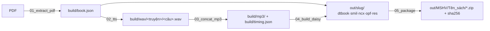

# Kế hoạch: sách nói DAISY 3 — *Những tấm lòng cao cả*

Đồ án môn Xử lý tiếng nói (K35). Hướng dẫn gốc: `input/[VR] DAISY Guidelines.pdf`. Bộ mẫu của nhóm K34 nằm ngoài repo (thư mục `mau/` cạnh repo).

## Bài toán

PDF có text sẵn (280 trang, ~101.700 từ, 99 bookmark) → sách DAISY 3 đầy đủ text + audio, đồng bộ cấp câu, mục lục 2 cấp (tháng → truyện). Đây là trường hợp 1 trong slide 11 (*có text, chưa có audio* → TTS thuần), không cần OCR hay STT.

## Pipeline

Mỗi bước là một script trong `scripts/` (gộp DTBook và SMIL/NCX/OPF vào một bước 04 vì cùng duyệt một cấu trúc; thứ tự đọc dùng chung nằm ở `book_units.py`), đọc từ bước trước, ghi ra `build/` (trung gian, xoá được) hoặc `out/` (nộp). Chạy lại một bước không cần chạy lại các bước trước.

## Quyết định và lý do

| Quyết định | Chọn | Vì sao | Đã loại | Xem lại khi |
|---|---|---|---|---|
| Đơn vị đồng bộ | **câu** | slide 6 yêu cầu cấp câu/cụm; TTS từng câu rồi **đo độ dài file** → `clipBegin/End` chính xác tuyệt đối, không cần forced alignment | từ (thừa), đoạn (không đạt yêu cầu) | không |
| Chia mp3 | **1 file / truyện** (~89 file) | slide 9 khuyến nghị chia nhỏ; sửa 1 câu chỉ render lại 1 truyện | 1 file/sách, 1 file/tháng | truyện > 30 phút → cân nhắc tách |
| TTS | **VieNeu-TTS v3 Turbo**, giọng **Đức Trí** (nam · Nam · đọc truyện) | người dùng chỉ định repo; đo thật trên M5 Pro: RTF 0,11 → cả sách ~1,5 h máy; miễn phí, offline, chạy lại vô hạn; 48 kHz; giọng chọn sau khi nghe 25 mẫu (`build/thu-giong/`) | edge-tts (dự phòng), Azure/Google (tốn tiền, online), Polly (không có tiếng Việt) | VieNeu đọc sai tên riêng Ý quá nhiều |
| Chú thích `[n]` | **đọc ngay sau đoạn chứa `[n]`** (sau dòng ngày nếu `[n]` ở tiêu đề), mở đầu "Chú thích:", không có "Hết chú thích"; `<note>` skippable mặc định đọc | người khiếm thị cần ngữ cảnh ngay lúc gặp từ lạ; skippability của DAISY sinh ra cho đúng việc này; khoảng nghỉ 1,2 s sau chú thích đủ làm ranh giới | gom cuối sách (92 chú thích liền nhau không số, vô dụng); cuối truyện (xa ngữ cảnh); xoá hẳn | không |
| Mã hoá mp3 | `lameenc` (LAME qua pip) | không phụ thuộc ffmpeg (máy không có); pip cài được trong `requirements.txt` | ffmpeg (cài ngoài Python) | cần bitrate thay đổi |
| Python | **3.12** | VieNeu hỗ trợ 3.10–3.13, repo ghim 3.12; onnxruntime chưa có wheel 3.14 | 3.14 (venv cũ) | VieNeu hỗ trợ 3.14 |
| Khoảng nghỉ khi ghép | **chốt 2026-09-20:** giữa câu **0,7 s** nghe được (0,6 + 2×0,05 lề), cuối đoạn **1,2 s**, sau tiêu đề 1,7–2,0 s | **đo chính VieNeu**: đọc liền 12 cặp câu, nó tự nghỉ trung vị 0,71 s (0,52–0,89). Từng thử 0,9 s nhưng đó là khi clip SMIL chưa bao khoảng nghỉ (Thorium thực phát 0 s); sửa xong nghe lại trong Thorium thì 0,7 s vừa | giữ im lặng gốc của từng clip (0,15–0,37 s, không đều); **time-stretch chậm 10–15 %** (librosa phase vocoder) — người nghe bác: quá chậm, âm nhoè | đổi giọng (mỗi giọng nhịp khác) → đo lại bằng đoạn code trong mục cạm bẫy 7 |
| Nhận diện cấu trúc | theo **font** (Arial-BoldMT 21 = tháng, Arial-BoldItalicMT 16 = truyện, BoldItal 16 sau h2 = dòng ngày, size 12 = chú thích) | PDF do calibre sinh, font nhất quán 100% qua khảo sát; bookmark chỉ để đối chiếu | heuristic chữ hoa / vị trí | đổi sách khác |

## Tiêu chí "xong" (kiểm chứng được)

- [x] `book.json` có đúng **99 heading** khớp bookmark PDF (1 Mở đầu + 10 tháng + 88 truyện) và **92 chú thích**
- [x] Mỗi `<sent>` trong dtbook.xml có đúng một `<par>` trong smil, không thừa không thiếu (script kiểm số lượng)
- [x] Tổng `clipEnd − clipBegin` của mỗi mp3 sai lệch < 0,1 s so với độ dài file thật
- [x] `dtb:totalTime` trong .opf = tổng thời lượng mp3 (không phải 0:00:00 như mẫu)
- [ ] Import **zip** sách vào Thorium Reader: nhảy tới "THÁNG BA › Cậu bé chết" phát đúng câu đầu truyện đó; tắt chú thích trong cài đặt đọc thì bỏ qua "Chú thích:…"
- [ ] Zip + sha256 đúng cây thư mục slide 21; `shasum -a 256 -c` báo OK

## Cạm bẫy đã gặp (đưa vào mục 4 báo cáo)

1. **onnxruntime 1.30 từ chối external data qua symlink** của HuggingFace cache → `HF_HUB_DISABLE_SYMLINKS=1` trước lần tải model đầu tiên; nếu đã tải symlink thì xoá `~/.cache/huggingface/hub/models--pnnbao-ump--*` và `models--OpenMOSS-Team--*`.
2. **Python 3.14** không cài được VieNeu → venv 3.12.
3. PDF mất chữ **"Â" hoa** ("châu u" thay cho "châu Âu") — lỗi font của calibre; cần bảng sửa trước TTS.
4. Lần `infer` đầu tiên của VieNeu chậm gấp 3 (khởi tạo graph ONNX) → làm nóng trước khi đo RTF.
5. pymupdf tách block khi trong dòng có span chú thích `[n]` (đổi chiều cao dòng) và gộp tiêu đề ngắn với dòng ngày → phân loại theo **dòng** rồi nối đoạn theo dấu câu + chữ thường.
6. Số đọc thành chữ dài ("4,444 km" → 7 s) kích hoạt cảnh báo "chậm bất thường" — không phải lỗi, nhưng QA phải nghe lại.
7. **Khoảng nghỉ giữa câu quá sát** khi ghép clip rời: TTS từng câu làm mất nhịp nghỉ tự nhiên. Không đoán số — cho VieNeu đọc liền từng cặp câu, tìm khoảng im lặng dài nhất ở giữa (ngưỡng 0,01, 48 kHz) → trung vị 0,71 s; đặt `PAUSE_AFTER` theo đó. Bước 3 lưu `pauses` vào `timing.json` để tự ghép lại khi cấu hình đổi.
8. **Trình đọc DAISY bỏ qua im lặng nằm giữa hai clip**: nó phát `clipBegin→clipEnd` rồi nhảy ngay sang par kế. Bản đầu ghi clip = đúng phần có tiếng → wav ghép nghe có nghỉ nhưng Thorium các câu dính nhau, và người nghe tưởng "giọng khác/nhanh hơn". Sửa: `clipEnd` = `clipBegin` câu sau (khoảng nghỉ thuộc câu trước). Hệ quả: số nghỉ 0,9 s được chọn khi Thorium thực phát 0 s → cần nghe lại và có thể trả về 0,7 s.
9. Thorium 3.4 nhận DAISY qua **zip hoặc thư mục**; mở thẳng `package.opf` nó coi là EPUB bung, không thấy media overlay và đọc bằng TTS hệ thống.
10. **VieNeu đọc "4,444 km" thành "bốn nghìn…"** (coi dấu phẩy là phân cách nghìn, trong khi sách dùng phẩy làm dấu thập phân). Rà regex `\d+[,.]\d+` toàn sách chỉ có 1 chỗ → sửa bản đọc qua `SOURCE_FIXES` thành "4 phẩy 444 km", chữ hiển thị giữ nguyên. Sách khác có nhiều số thập phân thì cần luật chuẩn hoá số trước TTS.
11. **VieNeu ngắt nhịp sai ở câu nhập nhằng cú pháp** ("Thầy giáo mới | ngay từ sáng" đọc thành "Thầy giáo | mới ngay từ sáng") và **lặp cụm từ** ở câu vốn đã có từ lặp ("đi đi, đi đi" đọc ba lần). Không tự phát hiện được, chỉ bắt bằng tai qua QA. Ngắt nhịp: thêm dấu phẩy vào bản đọc (`sua_cach_doc.csv`). Lặp: đã thử `repetition_penalty` 1,35/1,5 và `temperature` 0,5/0,3 — không nhất quán; cách dùng được là đọc lại N lần rồi **chọn bản có thời lượng gần kỳ vọng nhất** (bản lặp thừa luôn dài hơn), xem `scripts/06_doc_lai.py`.
12. **Bản ebook có ~25 lỗi chính tả** ("cổng chmh", "đuờng", "đểđược", "can dảm", "De Amlcis", "(l874)") khiến TTS đọc sai hoặc lắp. Rà toàn sách bằng `scripts/data/am_tiet_tieng_viet.txt` (6.775 âm tiết, lấy từ project2 của nhóm K34) + luật "âm tiết tiếng Việt không có 2 dấu thanh" + "chữ thường dính chữ HOA" → lọc còn ~50 từ nghi vấn, soi ngữ cảnh từng từ. Sửa trong `SOURCE_FIXES` (đổi **cả chữ hiển thị** vì sách in không sai những chỗ đó).
