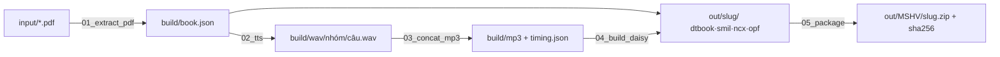

# Sách nói DAISY 3 — *Những tấm lòng cao cả*

Chuyển PDF có text sang sách nói DAISY 3 (văn bản + audio đồng bộ **từng câu**, mục lục 2 cấp tháng → truyện) bằng TTS tiếng Việt mã nguồn mở [VieNeu-TTS](https://github.com/pnnbao97/VieNeu-TTS), chạy hoàn toàn offline trên CPU.

Đồ án môn Xử lý tiếng nói. Hướng dẫn gốc: `input/[VR] DAISY Guidelines.pdf`. Quyết định kỹ thuật và lý do: [KE-HOACH.md](KE-HOACH.md).

## Việc của đồng đội: nghe và ghi nhận lỗi (QA)

Sách ~10,5 giờ, 5.200 câu. Mỗi câu có **id cố định** (`s000255`) và mốc thời gian trong mp3 của truyện — ghi nhận lỗi theo id, không ai phải tìm lại câu trong sách.

**Cách nhanh nhất, không cần cài gì:** tải `qa.html` + zip sách từ [Releases](../../releases), giải nén zip thành thư mục `Nhung_tam_long_cao_ca/` nằm **cạnh** `qa.html`, mở `qa.html` bằng Chrome/Edge/Safari.

**Có repo:** `make setup` một lần, rồi `make all` (đọc cả sách ~70 phút) hoặc chép `build/` của người khác về, sau đó `make qa`.

Trong trang QA:

| Thao tác | Kết quả |
|---|---|
| Bấm truyện ở mục lục trái | hiện toàn bộ câu của truyện, mỗi dòng `id · mốc giây · câu` |
| Bấm vào câu / `↓` `↑` | phát đúng câu đó |
| **▶ Nghe cả truyện**, `Space` | nghe liền, câu đang đọc bôi sáng |
| Tick ☐ cạnh câu, gõ ghi chú | ghi nhận lỗi (lưu trong trình duyệt, đóng tab không mất) |
| **⬇ Xuất CSV lỗi** | tải `qa_<slug>_<ngày>.csv` gồm `id, nhóm, truyện, câu, ghi_chu` |

Ghi chú nên nói **lỗi gì và ở từ nào**: "nghỉ sai sau *giáo*", "đọc *4,444* thành bốn nghìn", "tên *Garrone* đọc lạ". Gửi CSV cho người giữ repo (hoặc commit vào `qa/`).

**Người giữ repo:**

```bash
make merge-qa                 # gộp qa/*.csv vào sua_cach_doc.csv (mỗi id một dòng, giữ ghi chú của mọi người)
# mở sua_cach_doc.csv, điền cột speech = bản đọc mới cho từng id (thêm dấu phẩy, viết lại số, phiên âm tên…)
make fix                      # chỉ đọc lại câu có bản đọc đổi (vài giây/câu), ghép lại, dựng lại sách + trang QA
make qa                       # nghe lại đúng các câu đó
```

`sua_cach_doc.csv` chỉ đổi **bản đọc**; chữ hiển thị trong sách vẫn là nguyên văn. Cột `speech` trống = đã ghi nhận, chưa sửa. Cách chữa hay dùng: thêm dấu phẩy để ép ngắt nhịp ("Thầy giáo mới, ngay từ sáng…"), viết số thành chữ ("4 phẩy 444"), thêm "ngày" cho dòng ngày.

> **Không đổi quy tắc tách câu sau khi đã QA.** Id đánh tuần tự từ đầu sách; đổi cách tách câu là id trôi và CSV lệch. Bước 1 sẽ dừng nếu có id trong CSV không còn tồn tại.

## Cài đặt

Cần ≥ 8 GB RAM, ≥ 10 GB đĩa trống, mạng cho lần tải model đầu (~1 GB). VieNeu-TTS chỉ chạy trên **Python 3.10–3.13**; `scripts/setup.py` tự xử lý việc này:

| Máy đang có | `setup.py` làm gì |
|---|---|
| Python 3.10–3.13 | dùng luôn: tạo `.venv` bằng `python -m venv`, cài `requirements.txt` bằng pip |
| Python khác (3.9, 3.14…) | cài [uv](https://docs.astral.sh/uv/) qua pip, uv **tự tải Python 3.12** và tạo `.venv` |
| Đã có uv | dùng uv luôn, không cần Python đúng bản |

Cuối cùng nó chạy `00_check_env.py` và in bảng `[OK]/[WARN]/[FAIL]`.

### macOS / Linux

```bash
# Chưa có git/python: xcode-select --install (macOS)   |   sudo apt install git python3 python3-venv (Ubuntu)
git clone <repo> && cd daisy
python3 scripts/setup.py                 # hoặc: make setup
make check-tts                           # tải model, đọc thử 1 câu → RTF + ước lượng thời gian
make trial                               # ~3 phút: 1 truyện + chú thích → out/Nhung_tam_long_cao_ca/
make all                                 # cả sách: ~70 phút trên Apple M5 Pro (RTF 0,12)
```

Nghe thử: `brew install --cask thorium`, nén thư mục sách (`cd out && zip -0 -r sach.zip Nhung_tam_long_cao_ca`) rồi Import **file zip** vào Thorium Reader — import thẳng `package.opf` Thorium sẽ không nhận audio mà đọc bằng TTS hệ thống.

### Windows (PowerShell)

Cài [Git](https://git-scm.com/download/win) và Python từ [python.org](https://www.python.org/downloads/) (tick **Add python.exe to PATH**; bản nào cũng được, `setup.py` sẽ tự lo Python 3.12 nếu cần). Windows không có `make`, chạy thẳng script:

```powershell
git clone <repo>; cd daisy
py -3 scripts\setup.py                   # hoặc: python scripts\setup.py
$py = ".venv\Scripts\python.exe"
& $py scripts\00_check_env.py --tts      # kiểm máy + đọc thử
& $py scripts\01_extract_pdf.py          # bước 1
& $py scripts\02_tts.py front lv1-02 lv2-001 notes   # bước 2, dựng thử vài nhóm (~3 phút)
& $py scripts\03_concat_mp3.py           # bước 3
& $py scripts\04_build_daisy.py          # bước 4 → out\Nhung_tam_long_cao_ca\
& $py scripts\02_tts.py                  # cả sách (~70 phút M-series; x86 chậm hơn ~4×), rồi chạy lại bước 3-4
```

Nghe thử: cài [Thorium Reader](https://thorium.edrlab.org) (Microsoft Store) hoặc Dolphin EasyReader → nén thư mục `out\Nhung_tam_long_cao_ca` thành zip rồi Import **file zip** (không import `package.opf` lẻ).

Nếu PowerShell chặn script (`irm ... | iex`): `Set-ExecutionPolicy -Scope CurrentUser RemoteSigned`. Nếu `py` không có: dùng `python`.

### Chạy dở dang

Cứ chạy lại lệnh cũ — bước TTS bỏ qua câu đã có wav, bước 3 bỏ qua nhóm đã có mp3 mới hơn wav. Muốn đọc lại một truyện: xoá `build/wav/<nhóm>/` rồi chạy lại.

## Nộp bài

1. Điền `metadata.json`: mọi giá trị `CHUA_DIEN_*` (ISBN, sourceURL, người đóng góp, MSHV).
2. `make package` → `out/<MSHV1_MSHV2>/Nhung_tam_long_cao_ca/{Nhung_tam_long_cao_ca.zip, *_sha256sums.txt}` đúng cây thư mục slide 21.

## Pipeline



| Bước | `make` | Ra | Chạy lại khi |
|---|---|---|---|
| 0 | `check` / `check-tts` | báo cáo OK/WARN/FAIL | máy mới |
| 1 | `extract` | `build/book.json` — 99 heading, ~5.000 câu, 92 chú thích, đối chiếu tự động với bookmark PDF | sửa quy tắc tách câu / `SOURCE_FIXES` |
| 2 | `tts` · `tts-groups GROUPS=…` | `build/wav/<nhóm>/<id>.wav`, 1 file / câu | đổi giọng (`VOICE` trong `02_tts.py`), xoá wav muốn đọc lại |
| 3 | `mp3` | `build/mp3/<nhóm>.mp3` + `timing.json` (clipBegin/End tính từ số mẫu PCM) | đổi khoảng nghỉ (`PAUSE_AFTER` trong `book_units.py`) |
| 4 | `daisy` | `out/<slug>/` (chỉ gồm nhóm đã có audio, nên dựng thử vẫn mở được) + `out/qa.html` | luôn rẻ (giây) |
| 5 | `package` | zip + sha256 | trước khi nộp |
| QA | `qa` · `merge-qa` · `fix` | trang nghe-ghi nhận; gộp CSV; đọc lại câu đã sửa | mỗi vòng QA |

**Nhóm** = 1 file mp3 = 1 file smil: `front` (tên sách, tác giả) · `lv1-NN` (tiêu đề tháng, riêng `lv1-01` MỞ ĐẦU có nội dung) · `lv2-NNN` (88 truyện). 92 chú thích đọc **ngay sau đoạn** chứa `[n]`, mở đầu bằng "Chú thích:", đánh dấu skippable (Thorium: tắt/bật trong cài đặt đọc). Xem id trong `build/book.json`.

## Thư mục

| | Chứa | Không chứa |
|---|---|---|
| `input/` | PDF nguồn, slide hướng dẫn | — |
| `scripts/` | 6 bước đánh số + `book_units.py` (thứ tự đọc dùng chung) + `qa_template.html`, `dtbook.css`, `resources.res` | dữ liệu |
| `build/` | trung gian, **xoá được** (`make clean-*`), không commit | sản phẩm nộp |
| `out/` | sách DAISY và zip nộp, không commit | — |
| `metadata.json` | 9 trường slide 17 + MSHV | — |
| `sua_cach_doc.csv` | bản đọc sửa theo id câu (kết quả QA) | chữ hiển thị |
| `qa/` | CSV đồng đội xuất từ trang QA, đầu vào của `make merge-qa` | — |

Thêm bước mới → file `scripts/0N_ten.py` + target trong `Makefile`; thêm loại đơn vị đọc → sửa `book_units.py` (2–4 tự khớp).

## Cạm bẫy đã gặp

- **onnxruntime ≥ 1.30 từ chối model qua symlink** của HuggingFace cache. Script đã đặt `HF_HUB_DISABLE_SYMLINKS=1`; nếu từng tải model trước khi dùng repo này, `make check` báo FAIL kèm lệnh xoá cache.
- **Python 3.14** không cài được VieNeu (chỉ 3.10–3.13) → `scripts/setup.py` kiểm phiên bản, lệch thì dùng uv tải 3.12.
- Lần `infer` đầu tiên chậm gấp 3 (khởi tạo graph) — `check-tts` đã làm nóng trước khi đo.
- PDF do calibre sinh mất chữ **Â hoa** ("châu u") → `SOURCE_FIXES` trong `01_extract_pdf.py`.
- pymupdf tách block khi có chú thích `[n]` đổi chiều cao dòng → quy tắc nối đoạn theo dấu câu + chữ thường.
- **Trình đọc DAISY bỏ qua im lặng nằm giữa hai clip** → clip của câu phải bao luôn khoảng nghỉ sau nó (`clipEnd` = `clipBegin` câu kế).
- **Thorium đổi mọi thẻ DTBook thành `<div>`** (kể cả `noteref`) → `[n]` xuống dòng; chữa bằng `dtbook.css` đi kèm sách (Thorium viết lại selector thành `.noteref_R2`).
- Thorium nhận DAISY qua **zip/thư mục**, không phải `package.opf` lẻ (mở .opf nó dùng TTS hệ thống → giọng khác).
- VieNeu ngắt nhịp sai ở câu nhập nhằng cú pháp và đọc "4,444" thành bốn nghìn → không tự phát hiện được, chỉ bắt bằng tai qua QA rồi sửa bản đọc.

## Kiểm chứng đã cài trong script

- Bước 1 fail nếu heading trích ≠ 99 bookmark PDF hoặc noteref ↔ chú thích không khớp 1-1.
- Bước 4 fail nếu số `smilref` trong dtbook ≠ số `<par>` trong smil hoặc có smilref trỏ tới id không tồn tại; `dtb:totalTime` tính từ mp3 thật.
- Bước 5 fail nếu thiếu nhóm audio hoặc còn `CHUA_DIEN`.
- `make validate`: xmllint well-formed cho mọi file XML.
