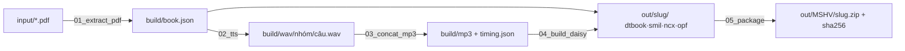

# Sách nói DAISY 3 — *Những tấm lòng cao cả*

Chuyển PDF có text sang sách nói DAISY 3 (văn bản + audio đồng bộ **từng câu**, mục lục 2 cấp tháng → truyện) bằng TTS tiếng Việt mã nguồn mở [VieNeu-TTS](https://github.com/pnnbao97/VieNeu-TTS), chạy hoàn toàn offline trên CPU.

Đồ án môn Xử lý tiếng nói. Hướng dẫn gốc: `input/[VR] DAISY Guidelines.pdf`. Quyết định kỹ thuật và lý do: [KE-HOACH.md](KE-HOACH.md).

## Bắt đầu trong 5 phút

Cần: macOS/Linux/Windows, Python **3.12** qua [uv](https://docs.astral.sh/uv/) (`brew install uv`), ≥ 8 GB RAM, ≥ 10 GB đĩa, mạng cho lần tải model đầu (~1 GB).

```bash
git clone <repo> && cd daisy
make setup        # tạo .venv + cài thư viện
make check-tts    # kiểm máy, tải model, đọc thử 1 câu → in RTF và ước lượng thời gian
make trial        # ~3 phút: dựng thử 1 truyện + chú thích → out/Nhung_tam_long_cao_ca/
```

Mở `out/Nhung_tam_long_cao_ca/package.opf` bằng [Thorium Reader](https://thorium.edrlab.org) (`brew install --cask thorium`) hoặc Dolphin EasyReader để nghe và nhảy mục lục.

Làm trọn cuốn:

```bash
make all          # ~70 phút trên Apple M5 Pro (RTF 0,12); x86 chậm hơn ~4×
```

Chạy dở dang cứ `make all` lại — bước TTS bỏ qua câu đã có wav.

## Nộp bài

1. Điền `metadata.json`: mọi giá trị `CHUA_DIEN_*` (ISBN, sourceURL, người đóng góp, MSHV).
2. `make package` → `out/<MSHV1_MSHV2>/Nhung_tam_long_cao_ca/{Nhung_tam_long_cao_ca.zip, *_sha256sums.txt}` đúng cây thư mục slide 21.

## Pipeline



| Bước | `make` | Ra | Chạy lại khi |
|---|---|---|---|
| 0 | `check` / `check-tts` | báo cáo OK/WARN/FAIL | máy mới |
| 1 | `extract` | `build/book.json` — 99 heading, ~5.000 câu, 92 chú thích, đối chiếu tự động với bookmark PDF | sửa quy tắc tách câu / `SOURCE_FIXES` |
| 2 | `tts` · `tts-groups GROUPS=…` | `build/wav/<nhóm>/<id>.wav`, 1 file / câu | đổi giọng (`VOICE` trong `02_tts.py`), xoá wav muốn đọc lại |
| 3 | `mp3` | `build/mp3/<nhóm>.mp3` + `timing.json` (clipBegin/End tính từ số mẫu PCM) | đổi khoảng nghỉ (`PAUSE_AFTER` trong `book_units.py`) |
| 4 | `daisy` | `out/<slug>/` — chỉ gồm nhóm đã có audio, nên dựng thử vẫn mở được | luôn rẻ (giây) |
| 5 | `package` | zip + sha256 | trước khi nộp |

**Nhóm** = 1 file mp3 = 1 file smil: `front` (tên sách, tác giả) · `lv1-NN` (tiêu đề tháng, riêng `lv1-01` MỞ ĐẦU có nội dung) · `lv2-NNN` (88 truyện) · `notes` (92 chú thích, skippable). Xem id trong `build/book.json`.

## Thư mục

| | Chứa | Không chứa |
|---|---|---|
| `input/` | PDF nguồn, slide hướng dẫn | — |
| `scripts/` | 6 bước đánh số + `book_units.py` (thứ tự đọc dùng chung) + `resources.res` mẫu | dữ liệu |
| `build/` | trung gian, **xoá được** (`make clean-*`), không commit | sản phẩm nộp |
| `out/` | sách DAISY và zip nộp, không commit | — |
| `metadata.json` | 9 trường slide 17 + MSHV | — |

Thêm bước mới → file `scripts/0N_ten.py` + target trong `Makefile`; thêm loại đơn vị đọc → sửa `book_units.py` (2–4 tự khớp).

## Cạm bẫy đã gặp

- **onnxruntime ≥ 1.30 từ chối model qua symlink** của HuggingFace cache. Script đã đặt `HF_HUB_DISABLE_SYMLINKS=1`; nếu từng tải model trước khi dùng repo này, `make check` báo FAIL kèm lệnh xoá cache.
- **Python 3.14** không cài được VieNeu (chỉ 3.10–3.13) → `make setup` ghim 3.12.
- Lần `infer` đầu tiên chậm gấp 3 (khởi tạo graph) — `check-tts` đã làm nóng trước khi đo.
- PDF do calibre sinh mất chữ **Â hoa** ("châu u") → `SOURCE_FIXES` trong `01_extract_pdf.py`.
- pymupdf tách block khi có chú thích `[n]` đổi chiều cao dòng → quy tắc nối đoạn theo dấu câu + chữ thường.

## Kiểm chứng đã cài trong script

- Bước 1 fail nếu heading trích ≠ 99 bookmark PDF hoặc noteref ↔ chú thích không khớp 1-1.
- Bước 4 fail nếu số `smilref` trong dtbook ≠ số `<par>` trong smil hoặc có smilref trỏ tới id không tồn tại; `dtb:totalTime` tính từ mp3 thật.
- Bước 5 fail nếu thiếu nhóm audio hoặc còn `CHUA_DIEN`.
- `make validate`: xmllint well-formed cho mọi file XML.
